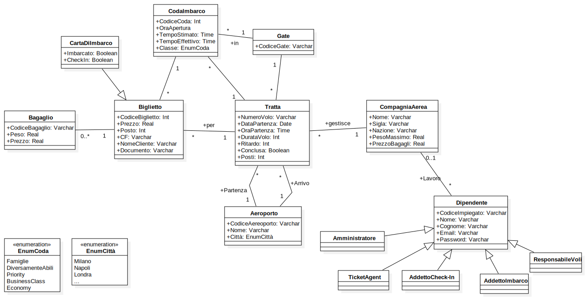
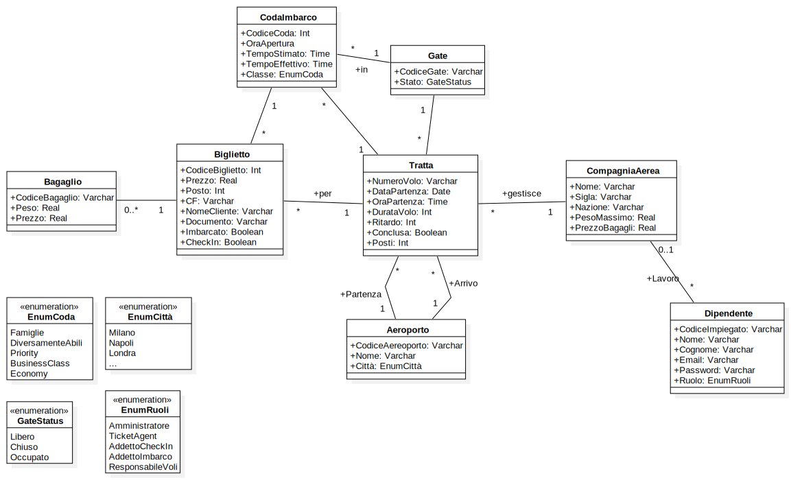
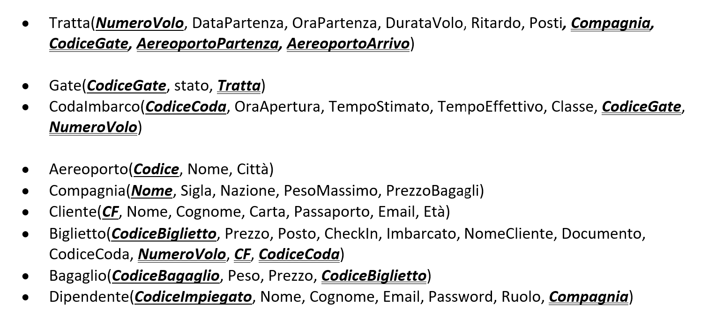
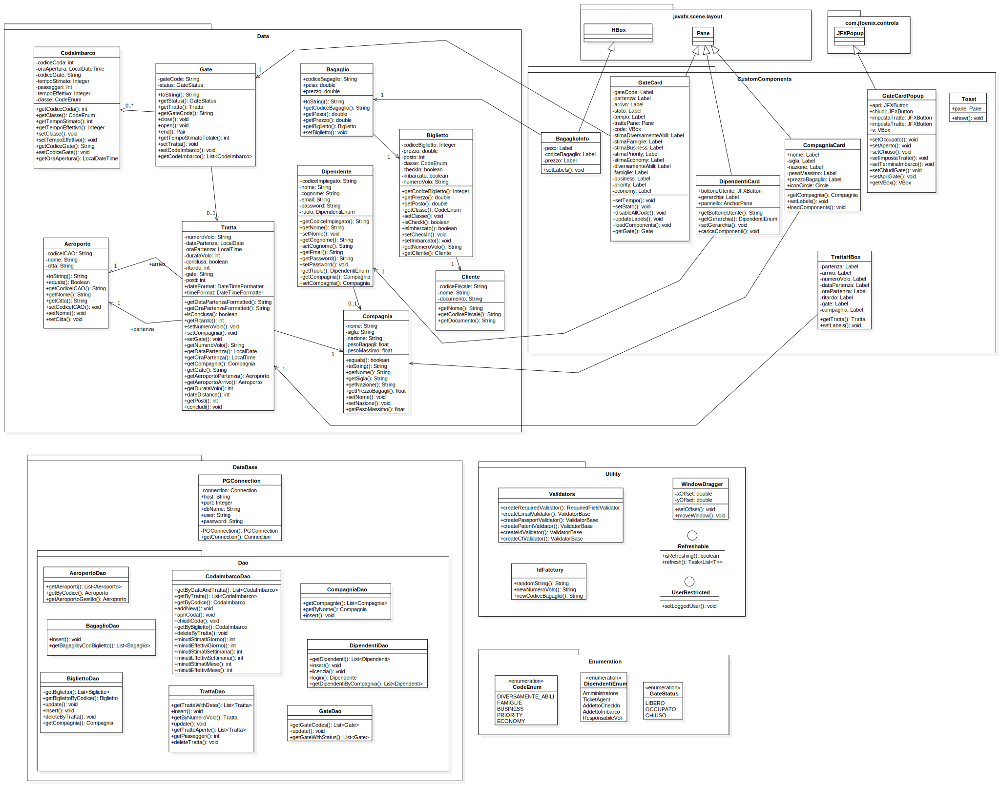
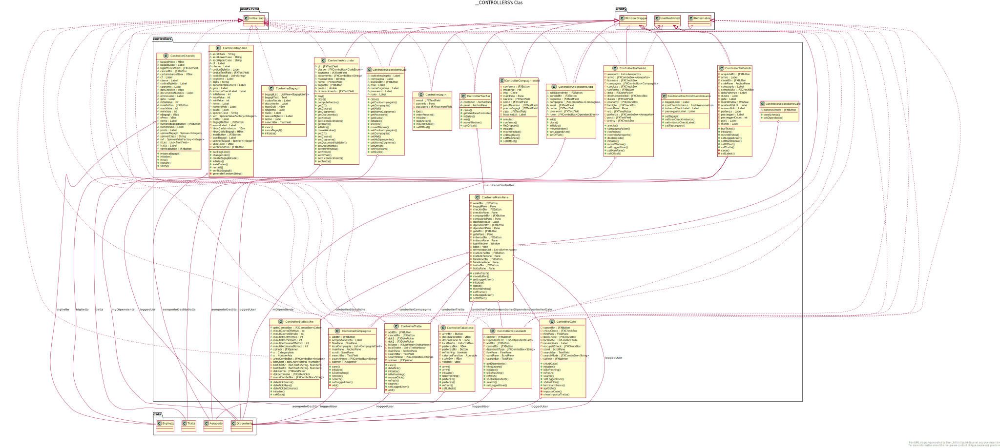

# ProgettoOOBD
## SISTEMA DI GESTIONE PER UNO SCALO AEROPORTUALE
- ### Si sviluppi un sistema informativo, composto da una base di dati relazionale e un applicativo Java dotato di GUI (Swing o JavaFX), per la gestione di uno scalo aeroportuale. Il sistema deve essere in grado di gestire: le tratte che interessano l’aeroporto, con relativa data e orario di partenza e numero di prenotazioni sulla tratta, i gate, e le compagnie aeree che hanno la base nell’aeroporto. Ad ogni gate è associata una o più code di imbarco (Famiglie, diversamente abili, priority, business class e così via). Un determinato gate è associato a diverse tratte nell’arco della giornata, ma mai a più di una contemporaneamente. Inoltre, ad ogni gate e tratta sono associati anche uno slot, inteso come tempo di imbarco stimato ed uno effettivo, per ognuna delle code presenti. Il sistema deve permettere di effettuare una ricerca dettagliata di tratte, gate e compagnie aeree, considerando anche le tempistiche di imbarco, evidenziando le tratte che sforano il tempo d’imbarco stimato. Il sistema dove permettere anche di stimare l’utilizzo di ogni gate nell’arco della giornata/settimana/mese, sia in base del tempo stimato di utilizzo, che in base al tempo effettivo.

# Database

# Database Revisionato

# Modello Logico Relazionale

# Java UML

